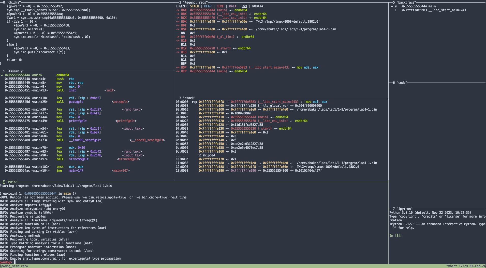

</br>

# Overview
```
This is a quick setup script to aid in installing/configuring important tools for vulnerability research and exploitation.   gdb with Pwndbg, GEF, Peda, Tmux, Ghidra, and Radare2. 

I built this since I ssh into my homelab to use these tools (I hate GUIs) and I wanted to have a quick setup script to get everything installed and configured in the case I need to rebuild my environment. 
```
</br>

# Tools Installed
```
- gdb
- gdb-gef
- gdb-peda
- gdb-peda-arm
- gdb-peda-intel
- gdb-pwndbg
- tmux
- r2ghidra 
- radare2
```

</br>

# Important Locations
```
- INSTALLDIR="$HOME/gdb_quick"
- CONFIGDIR="$HOME/.config"
- USER_GDBINIT="$HOME/.gdbinit"
```

</br>

# Installation (Ubuntu 20.04) 
```
cd $HOME
git clone https://github.com/abaker2010/gdb-quick-setup.git
cd gdb-quick-setup
chmod +x setup.sh
./setup.sh
```

</br>

# Coffee Break ☕ 
```
This will take a while to get everything installed and configured. A few of the tools are built from source, this helps to ensure compatibility with each system this is used on. 

Should take about 10-15 minutes to complete. 
```

</br>

# Usage (PWNDBG)
```
Preparing Terminal
------------------

Due to some of add-ons that were installed to work with splitting the terminal, you will need to use the following TMUX command before running PWNDBG. This will create a new tmux session called "pwndbg_session" and then you can run gdb with pwndbg. 

    Command
    -------

        tmux new -t pwndbg_session


Running PWNDBG
--------------

To run pwndbg, its pretty much the same command as plain GDB simply run the following command:

    Command
    -------
        pwndbg <binary>
```

</br>

# PWNDBG Example

<a href="https://github.com/abaker2010/gdb-quick-setup">
    
</a>